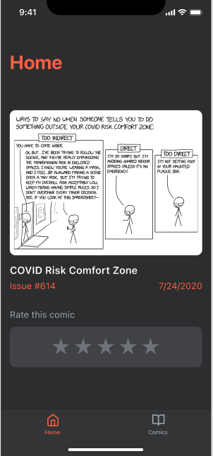
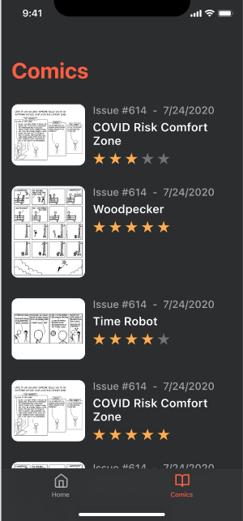

# Random comic iOS

This repository contains an iOS app for rating comics:

-   The main view displays a random comic to be rated.
-   Another view displays the list of previous comics rated.

The comics are fetched from the [xkcd api](https://xkcd.com/json.html)

The application is still being worked on, but the design that will have is as follows:

## Architecture

This project was built using VIPER architecture and [Generamba](https://github.com/strongself/Generamba) for module generation.

## Dependencies

This project uses Swift Package Manager to manage dependencies.

-   [Alamofire](https://github.com/Alamofire/Alamofire) to fetch comics from xkcd's API
-   [AlamofireImage](https://github.com/Alamofire/AlamofireImage) to fetch comics' images
-   [Promises](https://github.com/google/promises) to handle asynchronous code

If the dependencies have not been resolved you can:

-   Run `xcodebuild -resolvePackageDependencies` in the terminal
-   Or in Xcode go to `File -> Swift Packages -> Resolve Package Versions`

## How to run

Open `ComicRating.xcodeproj` and run the app.

If you get any errors about dependencies, make sure you have resolved them first (see [Dependencies section](#Dependencies))
